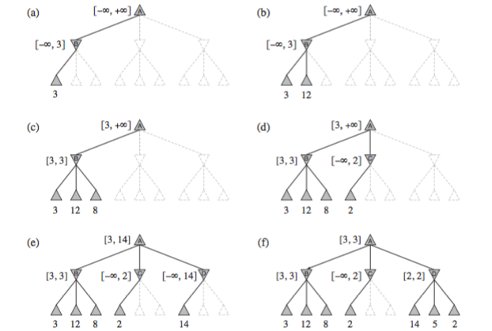
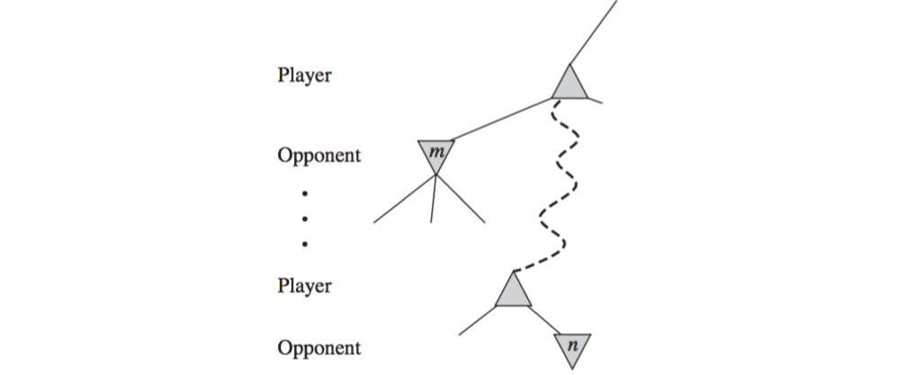
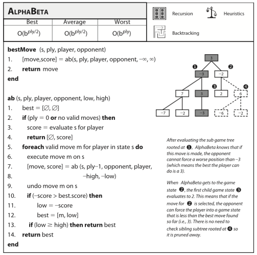
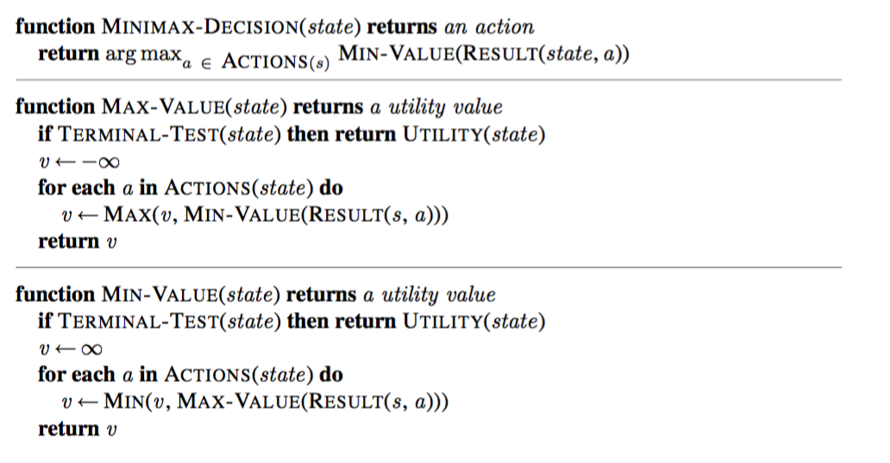
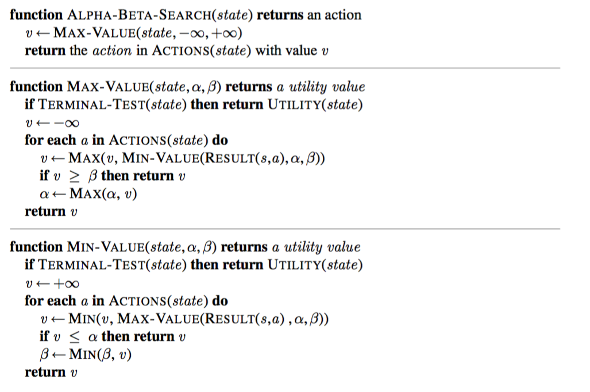

# Alpha-Beta Pruning

## Objectives

* Comprehend Alpha-Beta Pruning 

## Metrics/Desired Outcomes

* Implement alpha-beta pruning example

### Adversarial Search

We now consider something called `Adversarial Search`.  If `Min` and `Max` are adversaries so they will compete with each other at each move by selecting the best `option` while considering the opponent's next move.


Max would like to select *a1* is the optimal choice because highest value when it is MIN's turn to go.

### Pruning Concept

We want to ignore tree path that does not contribute to the final result one way or another.

## Alpha-Beta

The MINIMAX algorithm properly evaluates a player’s best move when considering the opponent’s countermoves.  This information is not while leveraged when generating tree.

Downside: even if a potentially bad move is ahead, minmax does not eliminate the sub-tree from consideration.  It does so with a consistent strategy to eliminate unproductive sub-tree from future search.



(a) The first leaf below B has the value 3. Hence, B, which is a MIN node, has a value of at most 3. 

(b) The second leaf below B has a value of 12; MIN would avoid this move, so the value of B is still at most 3. 

(c) The third leaf below B has a value of 8; we have seen all B’s successor states, so the value of B is exactly 3. Now, we can infer that the value of the root is at least 3, because MAX has a choice worth 3 at the root. 

(d) The first leaf below C has the value 2. Hence, C,which is a MIN node,has a value of at most2. But we know that B is worth 3, so MAX would never choose C. Therefore, there is no point in looking at the other successor states of C. This is an example of alpha–beta pruning. 

(e) The first leaf below D has the value 14, so D is worth at most 14. This is still higher than MAX’s best alternative (i.e., 3), so we need to keep exploring D’s successor states. Notice also that we now have bounds on all of the successors of the root, so the root’s value is also at most 14. 

(f) The second successor of D is worth 5, so again we need to keep exploring. The third successor is worth 2, so now D is worth exactly 2. MAX’s decision at the root is to move to B, giving a value of 3.



Generally speaking: if *m* is better than *n* for, then we will never see *n* so path leading up to *n* can be eliminated.

Back to adversarial search:

* Alpha is the value of the best (i.e., highest-value) choice we have found so far at any choice point along the path for MAX.

* Beta is the value of the best (i.e., lowest-value) choice we have found so far at any choice point along the path for MIN.

### Algorithm Summary

Strategy: Alpha-beta recursively search the game tree and tracks two values: alpha and beta.  A couple of observations (rules):



* As long as alpha < beta, the branch is consider an opportunity.
* Alpha is the lowerbound game states.
* If alpha is -INF if no information is available.  
* The higher alpha, the better the move.
* If alpha is +INF then a winning move is found.

## Algorithm

```java
public class AlphaBetaEvaluation implements IEvaluation {
  IGameState state;    /** State to be modified during search. */
  int ply;             /** Ply depth. How far to continue search. */

  public AlphaBetaEvaluation (int ply) { 
    this.ply = ply;
  }

  public IGameMove bestMove(IGameState s, IPlayer player, IPlayer opponent) {
    this.state = s.copy();
    MoveEvaluation move = alphabeta(ply, player, opponent, 
      MoveEvaluation.minimum(), MoveEvaluation.maximum()); 
    return move.move;
  }

  private MoveEvaluation alphabeta(int ply, IPlayer player, IPlayer opponent,
    int alpha, int beta) {
   // If no moves, return evaluation of board from player's perspective. 
   Iterator<IGameMove> it = player.validMoves(state).iterator();
   if (ply == 0 || !it.hasNext()) {
     return new MoveEvaluation(player.eval(state));
   }

   // Select "maximum of negative value of children" that improves alpha 
   MoveEvaluation best = new MoveEvaluation (alpha);
   while (it.hasNext()) {
     IGameMove move = it.next();
     // Recursively evaluate position.
     move.execute(state);
     MoveEvaluation me = alphabeta (ply-1, opponent, player, -beta, -alpha);
     move.undo(state);
     // If improved upon alpha, keep track of this move.
     if (-me.score > alpha) {
       alpha = -me.score;
       best = new MoveEvaluation (move, alpha);
     }
     if (alpha >= beta) { 
       return best;
     } // search no longer productive.
   }
   return best;
 }
}

```

### Min-Max and Alpha-Beta side-by-side Comparison




* S0: The initial state, which specifies how the game is set up at the start.
* PLAYER(s): Defines which player has the move in a state.
* ACTIONS(s): Returns the set of legal moves in a state.
* RESULT(s,a): The transition model, which defines the result of a move.
* TERMINAL-TEST(s): A terminal test, which is true when the game is over and false
otherwise. States where the game has ended are called terminal states.
* UTILITY(s, p): A utility function (also called an objective function or payoff function),
defines the final numeric value for a game that ends in terminal state s for a player p. 

## Analysis

Time complexity is *O(b^m)*

### References

Materials taken 
* Russell, Stuart.  Artificial Intelligence: A Modern Approach, 3rd Edition
* Heineman, G et al. [Algorithms in a Nutshell, 1st ed.](http://shop.oreilly.com/product/9780596516246.do) 
