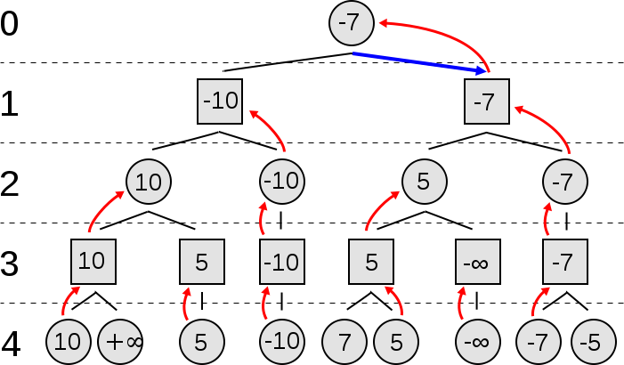

# Objectives

* Homework 2 Solution
* Decision Theory
* Minimax
* Homework 3 Announcement

# Metrics/Desired Outcomes

* Apply Minimax to solve simple game

## Minmax

* Used in decision theory/game theory
* 1 vs 1 game
* Under the assumption of both player plays their best moves
    * Minimize the loss at worst case
    * Opponent **minimize** the score
    * You **maximize** the score
* Originally covers only turn-based 2 players game
* This has been adapted to general games now
* Again relies on a **evaluate** function
* Eventually *tree traversal*

## Picture worthes a thousand words



## Examples

1. Tic-tac-toe
2. Zero sum number game

## Pseudocode

** [From Wikipedia](https://en.wikipedia.org/wiki/Minimax)**
```js
function minimax(node, depth, maximizingPlayer)
    if depth = 0 or node is a terminal node
        return the heuristic value of node
    if maximizingPlayer
        bestValue := -∞
        for each child of node
            val := minimax(child, depth - 1, FALSE)
            bestValue := max(bestValue, val)
        return bestValue
    else
        bestValue := +∞
        for each child of node
            val := minimax(child, depth - 1, TRUE)
            bestValue := min(bestValue, val)
        return bestValue

(* Initial call for maximizing player *)
minimax(origin, depth, TRUE)
```

**Our modification to use Graph interface**
```js
function minimax(graph, sourceNode, depth, maximizingPlayer) {
    // usually being optimized in a way to compute even before
    // the end of game by **evaluate** function
    if (depth = 0 || sourceNode is a leaf) {
        return evaluate(soureNode.gameState); // return a number
    }
    
    if (maximizingPlayer) {
        bestValue = Number.MAX_VALUE; // positive infinite
        for (node in graph.neighbors(sourceNode)) {
            value = minimax(node, graph, depth - 1, false);
            bestValue = Math.max(bestValue, value);
        }
        return bestValue;
    } else {
        bestValue = Number.MIN_VALUE; // negative infinite
        for (node in graph.neighbors(sourceNode)) {
            value = minimax(node, graph, depth - 1, true);
            bestValue = Math.min(bestValue, value);
        }
        return bestValue;
    }
}

// initial call of the above function to traverse 3 level for example
minimax(graph, startingNode, 3, TRUE); 
```